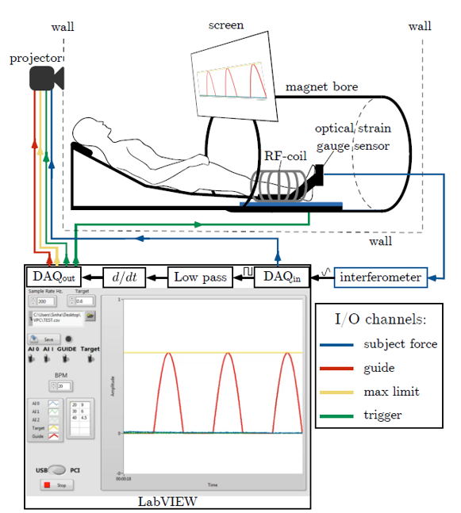
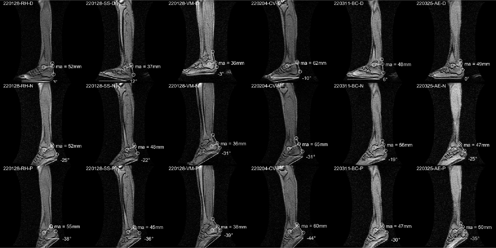
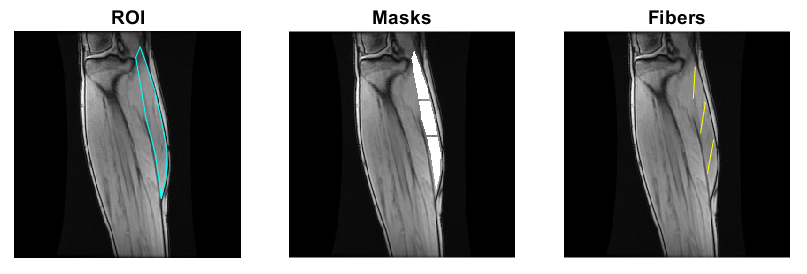
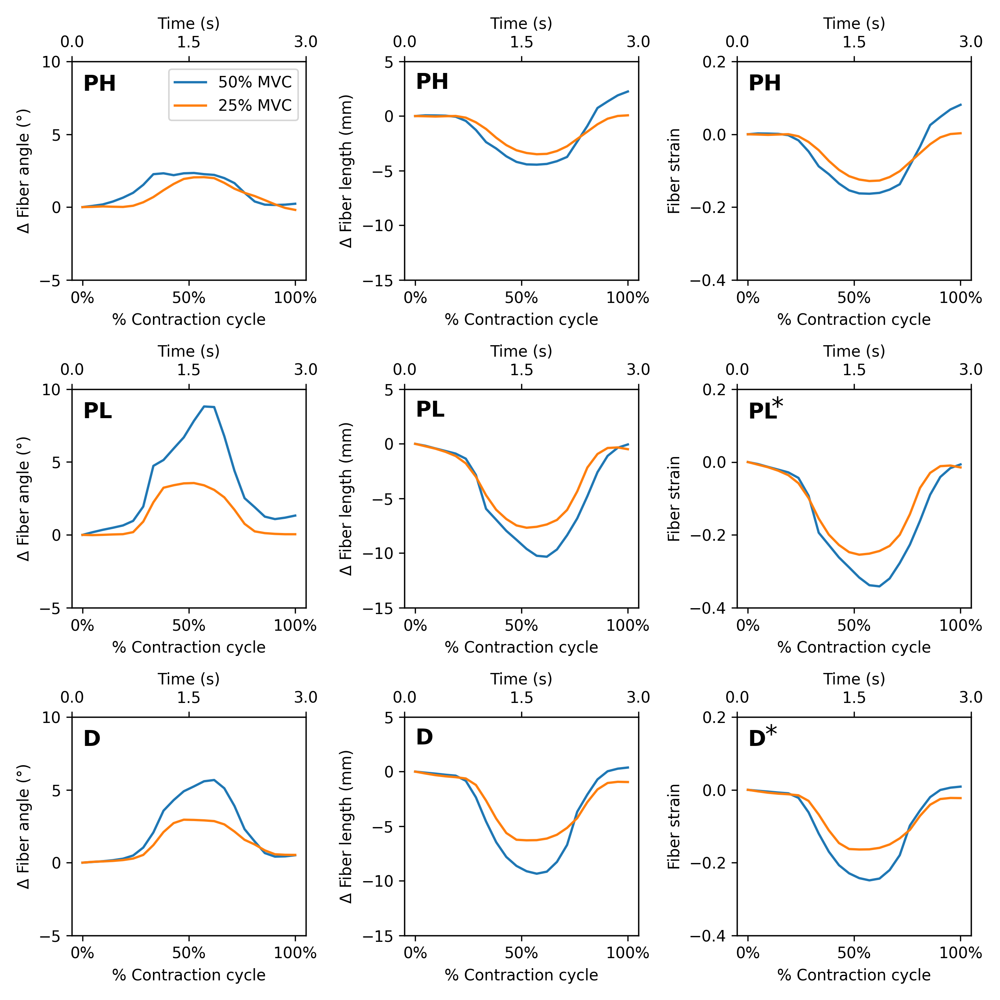
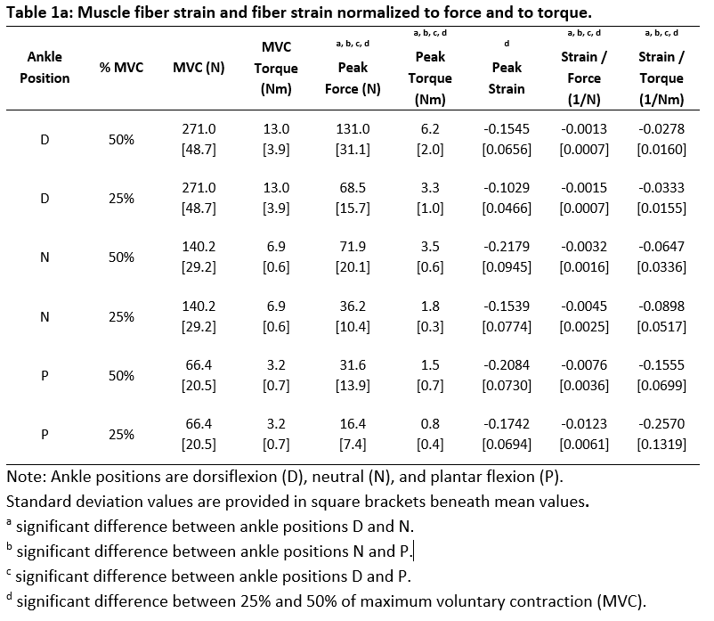
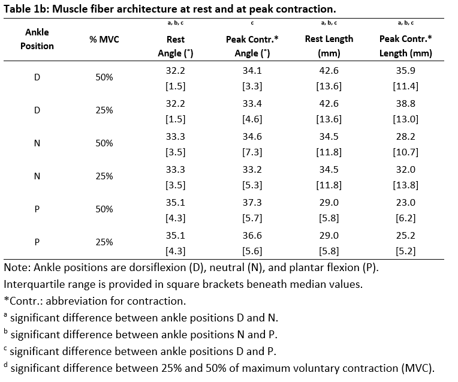

[Home](https://bcunnane.github.io/) • [Repository](https://github.com/bcunnane/fiber-tracking-py) • [Draft Paper](files/JMRI_draft.pdf)

This project develops MRI image processing methods to study muscle fiber strains in the medial gastrocnemius (MG) of the human calf. Specifically, it examines the effects of different ankle angles and exertion levels to identify the dependence of muscle force on muscle architecture.

### Collect Data
Data was collected for 6 subjects in a 1.5T MRI scanner as shown in Figure 1. The subject’s foot is positioned in a foot pedal fixture that records their pressing force. A projector prompts them to repeatedly press the pedal at a certain percentage of their maximum voluntary contraction (% MVC). This procedure is repeated for high (50% MVC) and low (25% MVC) pressing forces at three foot positions: dorsiflexion, neutral, and plantar flexion. Several different MRI sequences were utilzed to collect different image types, including:
1. Large field of view images to measure the subject's ankle position (see Figure 2)
2. Multiple slices of high resolution images to scout for an ideal slice with clear fibers
3. Diffusion images for the chosen slice
4. Dynamic (i.e. video) velocity images for the chosen slice

> *Figure 1. Experimental Setup*

> *Figure 2. Ankle angle measurements for all subjects. Top row shows dorsiflexion, middle shows neutral, and bottom shows plantar flextion.*
### Identify Muscle Fibers from Diffusion Tensors
Diffusion tensors are calculated from the diffusion images. Since the primary direction of water diffusion within skeletal muscle is along the muscle fiber, the diffusion tensor's principal eigenvector follows the muscle fiber's direction. An outline of the MG muscle was manually identified, then split into three equal-size regions: proximal, middle, and distal. Then the principal eigenvectors in each region were extracted and averaged to form representative fibers (see Figure 3).

> *Figure 3. Left: Manual outline of MG muscle. Center: Masks of the three regions of MG muscle. Right: Muscle fibers determined for later analysis (yellow).*
### Track Muscle Fibers and Analyze Changes
The endpoints of the DTI-identified muscle fibers were tracked through each frame of the dynamic study (See Figure 4). Changes in fiber angle were calculated with respect to the vertical in the image. Changes in fiber length were calculated with respect to initial length, leading to changes in Lagrangian strain. The results of the three muscle fibers were averaged together (see Figure 5). 

> *Figure 4. Average muscle fibers identified from diffusion tensor data for the proximal, middle, and distal regions of the MG muscle. Cine image shows change in fiber length and angle over contraction cycle for all exertion levels and ankle angles of a single subject.*

> *Figure 5. Change in fiber angle, length, and strain vs temporal cycle for the three foot positions. Determined from tracking change in position of the DTI-identified fibers throughout the muscle contraction cycle. The results for the fibers in the proximal, middle, and distal regions of the MG muscle were averaged for each percent MVC.*

### Statistical Analysis and Results
Normality of data was tested using both the Shapiro-Wilk test and visual inspection of Q-Q plots. Fiber strain and normalized fiber strains were normally distributed.
Two-way factorial ANOVA assessed differences between ankle angles and % MVC, as well as potential interaction effects. In case of significant ANOVA results for the factor ‘ankle angles’, Bonferroni-adjusted paired t-tests were used for post hoc analyses. Table 1a lists the mean and standard deviation (over all subjects) of MVC, MVC torque, peak force, peak torque, fiber strain, and normalized fiber strain for each foot position and % MVC.   

Fiber lengths and pennation angles at rest and peak contraction were not normally distributed, therefore, non-parametric testing was used. The Mann-Whitney U-test was used to compare the %MVC. Kruskal-Wallis tests were used to compare the ankle angles. Bonferroni-adjusted U-tests were also used for the post-hoc analysis. Table 1b lists the median and interquartile range (over all subjects) of fiber architecture (length and pennation angle) at rest and at peak contraction.   

### Discussion
The dorsiflexed ankle position showed significantly lower normalized strains at both %MVCs than the normal and plantarflexed ankle positions. This demonstrates that the dorsiflexed ankle position is at the optimum position for force production, followed by neutral, then plantar flexion. Dorsiflexion producing a high force with low strain could be of interest in rehabilitation paradigms and in optimizing athletic performance. Strain injury in skeletal muscle occurs when regions of a muscle experience localized strains that exceeds a threshold, so dorsiflexion yeilding overall lower strains indicates that high regional strains exceeding the threshold are less likely than in the neutral and plantarflexed positions.

In addition, strain increased less than linearly with %MVC. This departure from linearity is most pronounced in the plantarflexed ankle position, implying that with increasing contraction required to generate higher forces, the MG muscle may be approaching the critical length where further contraction becomes more difficult.
